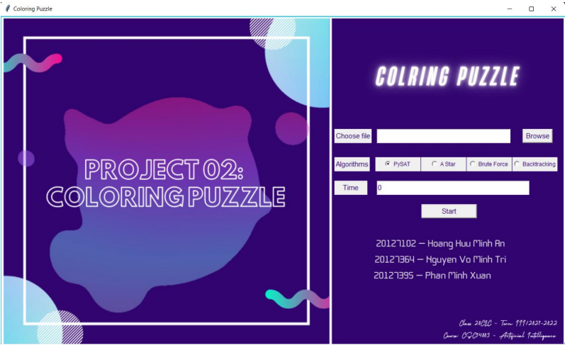

# COLORING PUZZLE
Build a coloring puzzle solver by using the first order logic to 
CNF

## Problem

- Given a matrix of size 𝑚×𝑛, where each cell will be a non-negative integer or zero (empty cell). Each cell is considered to be adjacent to itself and 8 surrounding cells.

- Your puzzle needs to color all the cells of the matrix with either blue or red, so that the number inside each cell corresponds to the number of blue squares adjacent to that cell

## Approaching

- Analyze how to define CNFs
- Design UIs
- Use the pysat library and CNFs to solve the problem
- Design brute-force and backtracking algorithms
- Implement brute-force and backtracking
- Connect the logic and how the UI works to emit the application

## UI

## Link

